# WhyProfile

Tiny SVG scene framework for GitHub profile banners. Write a banner in HTML-ish markup and CSS theme blocks; the CLI renders paired dark/light SVGs and a ready-to-paste README `<picture>` snippet.

## Generate

```bash
npm run build
```

Outputs:

- `assets/scene-dark.svg`
- `assets/scene-light.svg`
- `dist/picture-snippet.html`

`npm run build` reads `examples/profile-scene.html`.

To refresh GitHub star counts before rendering:

```bash
npm run sync:stars
npm run build
```

## README Snippet

```html
<p align="center">
  <picture>
    <source media="(prefers-color-scheme: dark)" srcset="./assets/scene-dark.svg">
    <source media="(prefers-color-scheme: light)" srcset="./assets/scene-light.svg">
    
  </picture>
</p>
```

## Edit

Change `examples/profile-scene.html`.

```html
<bf-scene width="1200" height="630" background="../assets/demo-background.svg">
  <style>
    :theme(dark) {
      --accent: #A855F7;
      --text: #FFFFFF;
      --panel: #050508;
    }

    :theme(light) {
      --accent: #7C3AED;
      --text: #1C1427;
      --panel: #FFFFFF;
    }
  </style>

  <bf-text x="600" y="142" class="title" anchor="middle">prplx</bf-text>
  <bf-terminal x="264" y="188" width="672" radius="12" effect="shadow" lines="building tools|shipping weird SVGs"></bf-terminal>
  <bf-row center-x="600" y="364" gap="16">
    <bf-pill label="Vellium" value="87★" repo="tg-prplx/vellium" accent="#8B5CF6" radius="8" animate="fade" delay="2.75"></bf-pill>
    <bf-chip label="Python" radius="6"></bf-chip>
  </bf-row>
</bf-scene>
```

The generated SVG includes invisible metadata:

```xml
<metadata>Generated with prplx Banner Framework</metadata>
<!-- generated-with: prplx-banner-framework -->
```

It does not appear on the banner image.

## HTML Tags

- `<bf-scene>` root banner: `width`, `height`, `radius`, `title`, `description`, `alt`, `background`
- `<bf-text>` SVG text: `x`, `y`, `class`, `anchor`
- `<bf-terminal>` animated terminal: `x`, `y`, `width`, `lines="one|two|three"` or nested `<bf-line>`
- `<bf-row>` horizontal layout: `x` or `center-x`, `y`, `gap`
- `<bf-pill>` two-part badge: `label`, `value`, `accent`, `width`
- `<bf-chip>` small label chip: `label`, `width`
- `<bf-panel>` rounded panel with nested elements
- `<bf-rect>`, `<bf-path>`, `<bf-group>`, `<bf-background>` lower-level escape hatches

## Advanced Controls

Most tags accept the same presentation controls:

- Shape: `radius`, `rx`, `width`, `height`, `x`, `y`
- Paint: `fill`, `stroke`, `fill-opacity`, `stroke-opacity`, `stroke-width`, `opacity`
- Effects: `effect="shadow"`, `effect="glow"`, `effect="glass"`
- Animation: `animate="fade"`, `animate="pulse"`, `animate="drift"`, plus `delay`, `duration`, `origin`
- Transforms: `translate="x y"`, `rotate`, `scale`
- Native escape hatches: `class`, `style`, `filter`, `transform`

For GitHub-backed badges, add `repo="owner/name"` to a `<bf-pill>` or `<bf-chip>` and run `npm run sync:stars`. The script updates that element's `value` to the current `N★` count.

Examples:

```html
<bf-scene radius="14" background="../assets/demo-background.svg">
  <bf-terminal
    x="264"
    y="188"
    width="672"
    radius="16"
    opacity="0.56"
    stroke-opacity="0.35"
    effect="shadow"
    lines="booting profile|loading projects">
  </bf-terminal>

  <bf-pill
    x="400"
    y="364"
    label="Vellium"
    value="87★"
    accent="#8B5CF6"
    radius="10"
    animate="fade"
    delay="2.75">
  </bf-pill>

  <bf-chip x="400" y="460" label="Python" radius="999" effect="glow"></bf-chip>
</bf-scene>
```

Theme CSS uses `:theme(dark)` and `:theme(light)` with custom properties:

```css
:theme(dark) {
  --accent: #A855F7;
  --accent-2: #46E3FF;
  --background: #100719;
  --border: #8A8A94;
  --panel: #050508;
  --panel-text: #EFE7FF;
  --text: #FFFFFF;
}
```

## Advanced JS

For full custom scenes, use `examples/profile-scene.config.mjs` or import from `src/index.js`. Advanced scenes receive a compact `components` API:

- `text(value, attrs)`
- `rect(attrs)`
- `group(children, attrs)`
- `pill({ label, value, x, y, accent })`
- `chip({ label, x, y })`
- `panel(options, children)`
- `terminal({ lines, x, y, width })`
- `centerRow(items, { centerX, y, gap, measure, render })`
- `svgFile(path, { className, x, y, width, height })`

Themes live under `themes.dark` and `themes.light`; the CLI renders both variants.

## Scene Shape

```js
export default defineScene({
  width: 1200,
  height: 630,
  radius: 10,
  themes: {
    dark: { text: '#fff', panel: '#050508' },
    light: { text: '#1C1427', panel: '#fff' }
  },
  async render({ components, theme }) {
    const { text, pill } = components;

    return [
      text('prplx', { x: 600, y: 142, class: 'title', 'text-anchor': 'middle' }),
      pill({ x: 400, y: 364, label: 'Vellium', value: '87★', accent: theme.accent })
    ];
  }
});
```

The renderer automatically adds:

- a rounded clip mask, so backgrounds do not leak outside the border
- a 1px theme-controlled border
- shared CSS animations: `fadeIn`, `bgDrift`, `typeIn`, `blink`, `softPulse`
- `scene-dark.svg` and `scene-light.svg`

## Custom Config

```bash
node src/cli.js examples/profile-scene.config.mjs --out assets --snippet dist/picture-snippet.html
node src/cli.js examples/profile-scene.html --out assets --snippet dist/picture-snippet.html
```

## Preview

Open `dist/preview.html` after running `npm run build`.

## License

MIT. See `LICENSE`.
